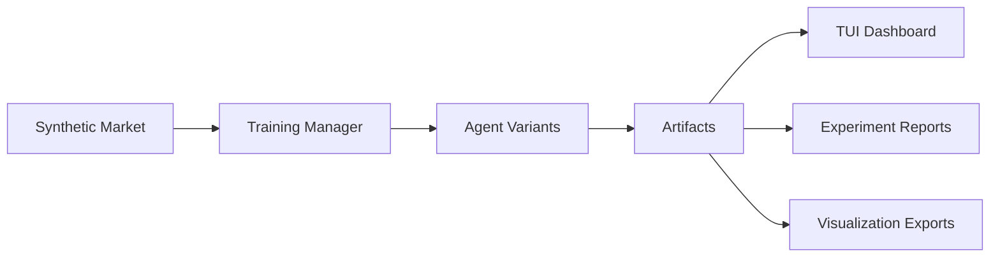

# RegimeForge

**RegimeForge** is a regime-aware reinforcement learning workbench for synthetic trading research.
It combines a hidden-regime market simulator, multiple agent baselines, a live terminal dashboard,
and experiment tooling for ablations, OOD sweeps, and artifact-driven analysis.

The public project name is **RegimeForge**. The internal Python package remains
`regime_lens` for compatibility.

## Why This Project Exists

Most toy RL trading repos stop at a single equity curve. RegimeForge is designed to answer a
harder question: did the agent actually learn market structure, or did it just get lucky on one
trajectory?

To make that inspectable, the project focuses on three things:

- A synthetic market with explicit hidden regimes such as `bull`, `bear`, `chop`, and `shock`
- Multiple policy families, including a regime-conditioned mixture-of-experts agent
- Instrumentation that exposes training progress, checkpoint performance, regime alignment, and expert specialization

## Core Features

- Synthetic hidden-regime market environment with configurable transition matrix and per-regime dynamics
- Multiple agent variants: vanilla DQN, Oracle DQN, HMM+DQN, and RCMoE-DQN
- Terminal-first dashboard with five views for training, regime analysis, experts, performance, and config
- Experiment runner for smoke tests, full benchmarks, ablations, and OOD generalization sweeps
- Artifact pipeline for checkpoints, summaries, metrics, regime analysis, and expert analysis
- Visualization helpers for curves, heatmaps, policy surfaces, gate evolution, and LaTeX export

## Project Snapshot



## Agent Families

- `dqn`: standard DQN baseline with no explicit regime model
- `oracle_dqn`: upper-bound baseline with true regime one-hot appended to observations
- `hmm_dqn`: two-stage regime detector plus DQN policy
- `rcmoe_dqn`: regime-conditioned mixture-of-experts DQN with gate routing and expert specialization analysis

## TUI Views

- `Overview`: latest reward, return, epsilon, loss, checkpoints, runtime, and baseline snapshots
- `Regime Lens`: live regime routing, gate accuracy, clustering alignment, and timeline context
- `Expert Deep Dive`: expert activations, utilization, dominance, and specialization summaries
- `Performance`: financial metrics, baseline comparison, and per-regime breakdowns
- `Config`: reproducibility-focused configuration and runtime context

Keyboard shortcuts:

- `1-5`: switch views
- `Tab` / `Shift+Tab`: change focus
- `Space`: pause or resume training
- `r`: toggle regime detail
- `e`: toggle expert detail
- `q`: exit the dashboard

## Repository Layout

```text
RL/
|-- backend/
|   |-- regime_lens/
|   |   |-- config.py
|   |   |-- market.py
|   |   |-- dqn.py
|   |   |-- oracle_dqn.py
|   |   |-- hmm_dqn.py
|   |   |-- rcmoe.py
|   |   |-- training.py
|   |   |-- tui.py
|   |   |-- run_experiments.py
|   |   `-- visualization.py
|   |-- README.md
|   `-- pyproject.toml
|-- docs/
|   |-- architecture.md
|   |-- experiments.md
|   `-- ui-guide.md
|-- scripts/
|   `-- start_tui.ps1
`-- README.md
```

## Quick Start

### 1. Create or activate a Python environment

The project targets Python `3.12+`.

```powershell
cd D:\RL\backend
D:\miniconda\envs\statshell\python.exe -m pip install -e .
```

### 2. Launch the dashboard

From the repository root:

```powershell
powershell -ExecutionPolicy Bypass -File D:\RL\scripts\start_tui.ps1
```

Direct Python entry:

```powershell
cd D:\RL\backend
D:\miniconda\envs\statshell\python.exe -m regime_lens.tui --fresh --lang en --charset unicode
```

### 3. Plan or run experiments

```powershell
cd D:\RL
D:\miniconda\envs\statshell\python.exe -m backend.regime_lens.run_experiments plan --suite full
D:\miniconda\envs\statshell\python.exe -m backend.regime_lens.run_experiments run --suite smoke --experiment-name demo_smoke
```

## Experiment Suites

- `smoke`: short pipeline validation run
- `full`: core benchmark matrix across agent families and baselines
- `ablation`: RCMoE sweeps across expert count, gate width, hidden size, and load-balancing weight
- `ood`: generalization sweeps under altered persistence, switching frequency, or volatility
- `all`: full benchmark plus ablations plus OOD suites

Generated reports are written under `backend/artifacts/_experiments`.

## Documentation

- [Architecture](docs/architecture.md)
- [Experiment Guide](docs/experiments.md)
- [UI Guide](docs/ui-guide.md)
- [Backend Package Notes](backend/README.md)

## Engineering Notes

- The repository is terminal-first. There is no web UI or backend API service.
- The PowerShell launcher is Windows-oriented, but the Python modules are usable directly.
- Artifact directories are intentionally excluded from version control.

## Contributing

See [CONTRIBUTING.md](CONTRIBUTING.md) for local setup, coding expectations, and pull request guidance.

## License

This repository is released under the [MIT License](LICENSE).
