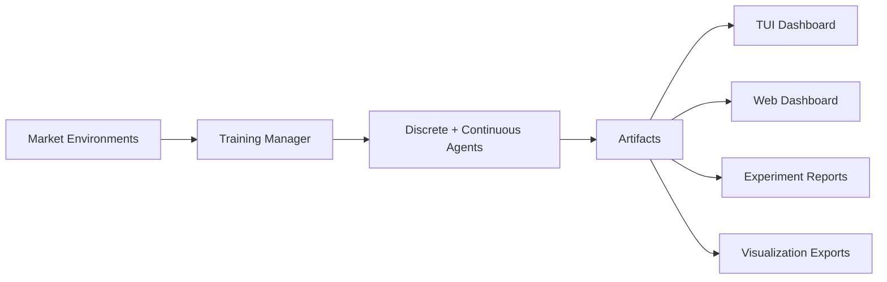

# RegimeForge

**RegimeForge** is a regime-aware reinforcement learning workbench for synthetic trading research.
It combines hidden-regime market simulators, multiple discrete and continuous RL baselines,
live dashboards, and experiment tooling for ablations, OOD sweeps, and artifact-driven analysis.

The public project name is **RegimeForge**. The internal Python package remains
`regime_lens` for compatibility.

## Why This Project Exists

Most toy RL trading repos stop at a single equity curve. RegimeForge is designed to answer a
harder question: did the agent actually learn market structure, or did it just get lucky on one
trajectory?

To make that inspectable, the project focuses on three things:

- Synthetic and semi-realistic market configurations with explicit hidden regimes such as `bull`, `bear`, `chop`, and `shock`
- Multiple policy families, including discrete DQN agents and continuous actor-critic agents
- Instrumentation that exposes training progress, checkpoint performance, regime alignment, expert specialization, and reproducibility metadata

## Core Features

- Synthetic hidden-regime market environments with configurable transition matrices and per-regime dynamics
- Semi-realistic data mode that fits regime parameters from local price CSVs and injects them into training configs
- Discrete agent variants: vanilla DQN, Oracle DQN, HMM+DQN, RCMoE-DQN, and Transformer-DQN
- Continuous actor-critic variants for PPO, SAC, and gated RCMoE actor-critic experiments
- Dreamer-style world-model experiments with RSSM dynamics and latent-space actor/critic training
- Multi-asset and non-stationary continuous market paths for robustness checks
- Terminal dashboard and FastAPI artifact dashboard for inspecting runs and checkpoints
- Experiment runner for smoke tests, full benchmarks, ablations, OOD sweeps, parallel execution, and report rebuilds
- Artifact pipeline for model weights, resume state, summaries, metrics, stats, explainability, and reproducibility metadata
- Visualization helpers for curves, heatmaps, policy surfaces, gate evolution, and LaTeX export

## Project Snapshot



## Agent Families

- `dqn`: standard DQN baseline with no explicit regime model
- `oracle_dqn`: upper-bound baseline with true regime one-hot appended to observations
- `hmm_dqn`: lightweight GMM detector plus DQN policy, used as the current HMM-style proxy baseline
- `rcmoe_dqn`: regime-conditioned mixture-of-experts DQN with gate routing and expert specialization analysis
- `transformer_dqn`: DQN with a Transformer encoder over flattened observation histories
- `world_model`: Dreamer-style latent dynamics agent for discrete market experiments
- `ppo`: continuous actor-critic policy over allocation weights
- `sac`: off-policy continuous actor-critic policy over allocation weights
- `rcmoe` actor-critic: gated expert actor-critic path for continuous PPO/SAC variants

## Dashboards

The Rich TUI remains the best live training view. The FastAPI dashboard is an artifact-first
viewer for completed or running experiment directories.

- `Overview`: latest reward, return, epsilon, loss, checkpoints, runtime, and baseline snapshots
- `Regime Lens`: live regime routing, gate accuracy, clustering alignment, and timeline context
- `Expert Deep Dive`: expert activations, utilization, dominance, and specialization summaries
- `Performance`: financial metrics, baseline comparison, and per-regime breakdowns
- `Config`: reproducibility-focused configuration and runtime context

Start the web dashboard:

```powershell
cd D:\RL\backend
D:\miniconda\envs\statshell\python.exe -m regime_lens.web --artifact-root D:\RL\backend\artifacts
```

Keyboard shortcuts:

- `1-5`: switch views
- `Tab` / `Shift+Tab`: change focus
- `Space`: pause or resume training
- `r`: toggle regime detail
- `e`: toggle expert detail
- `q`: exit the dashboard

## Repository Layout

```text
RL/
|-- backend/
|   |-- regime_lens/
|   |   |-- config.py
|   |   |-- agent_io.py
|   |   |-- market.py
|   |   |-- dqn.py
|   |   |-- oracle_dqn.py
|   |   |-- hmm_dqn.py
|   |   |-- rcmoe.py
|   |   |-- transformer_agent.py
|   |   |-- world_model.py
|   |   |-- training.py
|   |   |-- tui.py
|   |   |-- web.py
|   |   |-- run_experiments.py
|   |   |-- continuous_agent.py
|   |   |-- continuous_market.py
|   |   |-- config_io.py
|   |   |-- data.py
|   |   |-- stats_ext.py
|   |   |-- explainability.py
|   |   `-- visualization.py
|   |-- README.md
|   `-- pyproject.toml
|-- docs/
|   |-- architecture.md
|   |-- experiments.md
|   `-- ui-guide.md
|-- scripts/
|   `-- start_tui.ps1
`-- README.md
```

## Quick Start

### 1. Create or activate a Python environment

The project targets Python `3.12+`.

```powershell
cd D:\RL\backend
D:\miniconda\envs\statshell\python.exe -m pip install -e .
```

### 2. Launch the dashboard

From the repository root:

```powershell
powershell -ExecutionPolicy Bypass -File D:\RL\scripts\start_tui.ps1
```

Direct Python entry:

```powershell
cd D:\RL\backend
D:\miniconda\envs\statshell\python.exe -m regime_lens.tui --fresh --lang en --charset unicode
```

### 3. Plan, run, or serve experiments

```powershell
cd D:\RL\backend
D:\miniconda\envs\statshell\python.exe -m regime_lens.run_experiments plan --suite full
D:\miniconda\envs\statshell\python.exe -m regime_lens.run_experiments run --suite smoke --experiment-name demo_smoke
D:\miniconda\envs\statshell\python.exe -m regime_lens.run_experiments serve --artifact-root D:\RL\backend\artifacts
```

## Experiment Suites

- `smoke`: short pipeline validation run
- `full`: core benchmark matrix across agent families and baselines
- `ablation`: RCMoE sweeps across expert count, gate width, hidden size, and load-balancing weight
- `ood`: generalization sweeps under altered persistence, switching frequency, volatility, or drift
- `all`: full benchmark plus ablations plus OOD suites

Generated reports are written under `backend/artifacts/_experiments`.

Continuous-action smoke example:

```powershell
cd D:\RL\backend
D:\miniconda\envs\statshell\python.exe -m regime_lens.run_experiments run --suite smoke --algorithm sac --continuous-actions --episodes 1 --evaluation-episodes 1
```

## Documentation

- [Architecture](docs/architecture.md)
- [Experiment Guide](docs/experiments.md)
- [UI Guide](docs/ui-guide.md)
- [Backend Package Notes](backend/README.md)

## Engineering Notes

- The repository is artifact-first. TUI, Web dashboard, reports, and visualization helpers all read the same run/checkpoint layout.
- Agent-specific observation shaping lives in `backend/regime_lens/agent_io.py`; train, eval, policy-surface, and explainability paths should go through that adapter instead of open-coding Oracle/HMM/context transforms.
- The PowerShell launcher is Windows-oriented, but the Python package entry points are usable directly.
- Artifact directories are intentionally excluded from version control.

## Contributing

See [CONTRIBUTING.md](CONTRIBUTING.md) for local setup, coding expectations, and pull request guidance.

## License

This repository is released under the [MIT License](LICENSE).
